# Casos de uso y diagramas de secuencia

Fuente: capítulo IV del reporte. Cada caso incluye su especificación y su diagrama de secuencia (Mermaid; GitHub lo dibuja).

| Caso | Nombre | Interfaz |
|---|---|---|
| [CU-01](#cu-01) | Iniciar la aplicación | MOV-00 |
| [CU-02](#cu-02) | Iniciar sesión en la app | MOV-01 |
| [CU-03](#cu-03) | Registrar una cuenta | MOV-02 |
| [CU-04](#cu-04) | Recuperar la contraseña | MOV-03 |
| [CU-05](#cu-05) | Consultar notificaciones | MOV-04 |
| [CU-06](#cu-06) | Buscar vacantes | CAN-01 |
| [CU-07](#cu-07) | Consultar una vacante y postularse | CAN-02 |
| [CU-08](#cu-08) | Gestionar mi perfil | CAN-03 |
| [CU-09](#cu-09) | Gestionar mi CV | CAN-04 |
| [CU-10](#cu-10) | Consultar mis postulaciones | CAN-05 |
| [CU-11](#cu-11) | Dar seguimiento a una postulación | CAN-06 |
| [CU-12](#cu-12) | Consultar empresas | CAN-07 |
| [CU-13](#cu-13) | Gestionar el perfil de la organización | REC-01 |
| [CU-14](#cu-14) | Administrar mis vacantes | REC-02 |
| [CU-15](#cu-15) | Crear o editar una vacante | REC-03 |
| [CU-16](#cu-16) | Revisar candidatos postulados | REC-04 |
| [CU-17](#cu-17) | Evaluar a un postulado | REC-05 |
| [CU-18](#cu-18) | Gestionar la agenda de entrevistas | REC-06 |
| [CU-19](#cu-19) | Iniciar sesión en el panel web | WEB-01 |
| [CU-20](#cu-20) | Consultar el dashboard y las estadísticas | WEB-02 |
| [CU-21](#cu-21) | Gestionar usuarios | WEB-03 |
| [CU-22](#cu-22) | Validar y gestionar empresas | WEB-04 |
| [CU-23](#cu-23) | Moderar vacantes | WEB-05 |
| [CU-24](#cu-24) | Gestionar categorías y habilidades | WEB-06 |
| [CU-25](#cu-25) | Gestionar catálogos | WEB-07 |
| [CU-26](#cu-26) | Atender reportes e incidencias | WEB-08 |
| [CU-27](#cu-27) | Atender peticiones de los clientes (API) | API |

## CU-01

**Iniciar la aplicación** · Interfaz: MOV-00 · Actor: Usuario · Secundarios: Ninguno

**Precondiciones**

- La aplicación está instalada en el dispositivo.

**Flujo principal**

1. El usuario abre la aplicación.
2. El sistema muestra el logotipo de IncluTec durante un máximo de 3 segundos.
3. El sistema lee el token guardado en el almacenamiento seguro y lo valida con GET /auth/me.
4. Si el token es válido, el sistema lleva al usuario a la pantalla principal de su rol: CAN-01 (candidato) o REC-02 (reclutador).

**Flujos alternos**

- 3a. No hay token guardado o el API responde 401: el sistema elimina el token y muestra MOV-01.
- 3b. Sin conexión: el sistema avisa que no hay conexión y ofrece reintentar.

**Postcondiciones**

- El usuario queda en la pantalla principal de su rol o en el inicio de sesión.

**Requerimientos:** MOV-00: RF-01 y RF-02

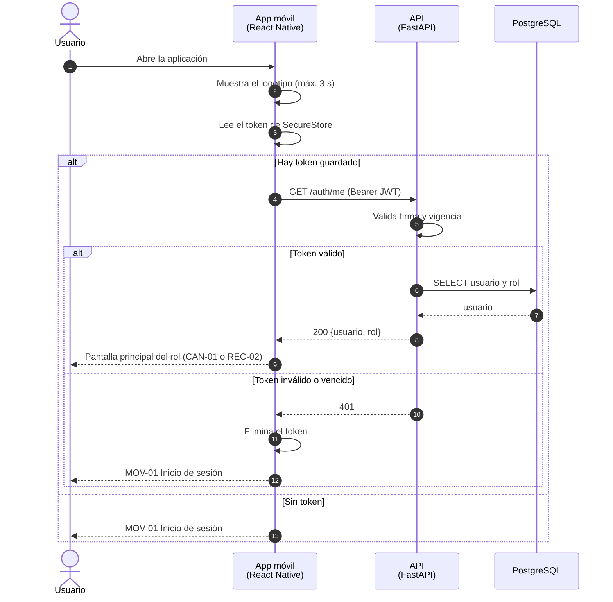
```mermaid
sequenceDiagram
autonumber
actor U as Usuario
participant APP as App móvil<br/>(React Native)
participant API as API<br/>(FastAPI)
participant DB as PostgreSQL
U->>APP: Abre la aplicación
APP->>APP: Muestra el logotipo (máx. 3 s)
APP->>APP: Lee el token de SecureStore
alt Hay token guardado
  APP->>API: GET /auth/me (Bearer JWT)
  API->>API: Valida firma y vigencia
  alt Token válido
    API->>DB: SELECT usuario y rol
    DB-->>API: usuario
    API-->>APP: 200 {usuario, rol}
    APP-->>U: Pantalla principal del rol (CAN-01 o REC-02)
  else Token inválido o vencido
    API-->>APP: 401
    APP->>APP: Elimina el token
    APP-->>U: MOV-01 Inicio de sesión
  end
else Sin token
  APP-->>U: MOV-01 Inicio de sesión
end
```

## CU-02

**Iniciar sesión en la app** · Interfaz: MOV-01 · Actor: Usuario · Secundarios: Ninguno

**Precondiciones**

- El usuario tiene una cuenta activa con rol candidato o reclutador.

**Flujo principal**

1. El usuario captura su correo y contraseña.
2. El sistema habilita el botón «Iniciar sesión» cuando ambos campos son válidos.
3. El usuario presiona «Iniciar sesión» y el sistema envía las credenciales a POST /auth/login.
4. El API valida las credenciales y devuelve un JWT con el rol del usuario.
5. El sistema guarda el token en expo-secure-store y registra el dispositivo para notificaciones.
6. El sistema lleva al usuario a CAN-01 o REC-02 según su rol.

**Flujos alternos**

- 4a. Credenciales inválidas (401): el sistema muestra «Correo o contraseña incorrectos» sin revelar cuál falló.
- 4b. Cuenta suspendida (423): el sistema muestra «Tu cuenta está suspendida».
- 4c. Cinco intentos fallidos: el API bloquea temporalmente el acceso por 15 minutos.
- 6a. El rol es administrador: el sistema indica que debe usar el panel web y cierra la sesión.

**Postcondiciones**

- El usuario tiene una sesión activa con un token válido por 8 horas.

**Requerimientos:** MOV-01: RF-01 a RF-05

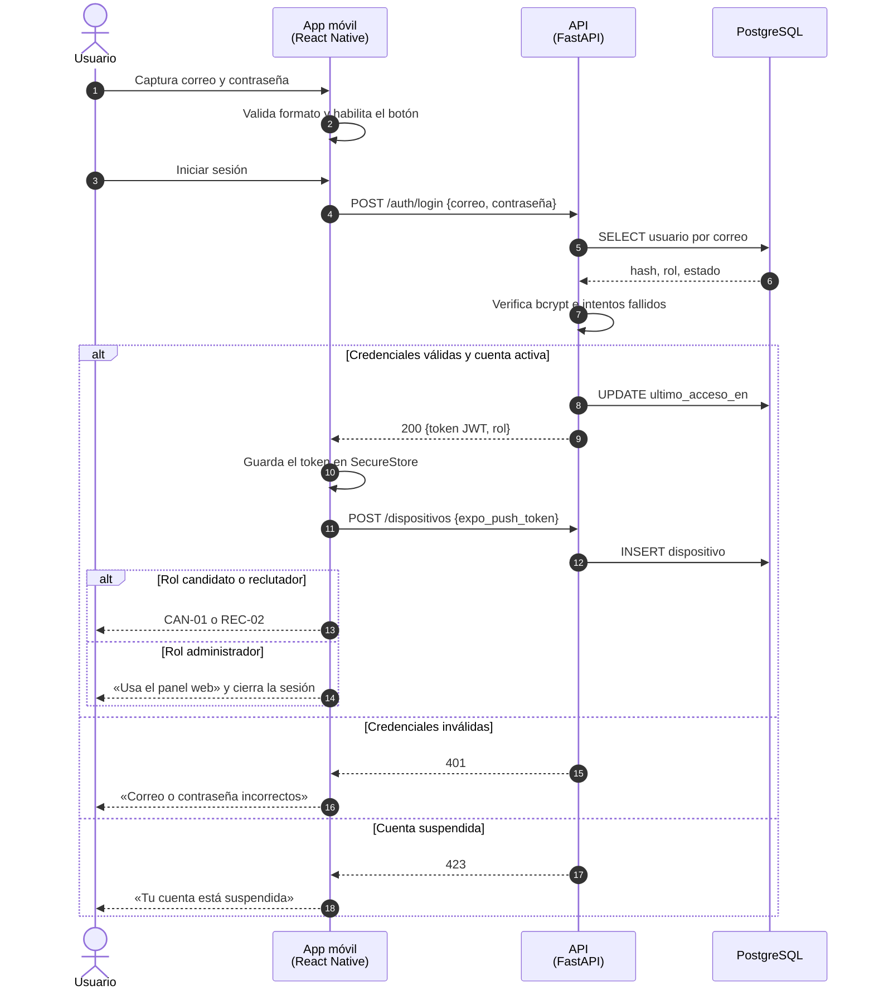
```mermaid
sequenceDiagram
autonumber
actor U as Usuario
participant APP as App móvil<br/>(React Native)
participant API as API<br/>(FastAPI)
participant DB as PostgreSQL
U->>APP: Captura correo y contraseña
APP->>APP: Valida formato y habilita el botón
U->>APP: Iniciar sesión
APP->>API: POST /auth/login {correo, contraseña}
API->>DB: SELECT usuario por correo
DB-->>API: hash, rol, estado
API->>API: Verifica bcrypt e intentos fallidos
alt Credenciales válidas y cuenta activa
  API->>DB: UPDATE ultimo_acceso_en
  API-->>APP: 200 {token JWT, rol}
  APP->>APP: Guarda el token en SecureStore
  APP->>API: POST /dispositivos {expo_push_token}
  API->>DB: INSERT dispositivo
  alt Rol candidato o reclutador
    APP-->>U: CAN-01 o REC-02
  else Rol administrador
    APP-->>U: «Usa el panel web» y cierra la sesión
  end
else Credenciales inválidas
  API-->>APP: 401
  APP-->>U: «Correo o contraseña incorrectos»
else Cuenta suspendida
  API-->>APP: 423
  APP-->>U: «Tu cuenta está suspendida»
end
```

## CU-03

**Registrar una cuenta** · Interfaz: MOV-02 · Actor: Usuario · Secundarios: Ninguno

**Precondiciones**

- El usuario no tiene una cuenta registrada con su correo.

**Flujo principal**

1. El usuario elige «Busco empleo» o «Represento a una empresa».
2. El sistema muestra el formulario correspondiente.
3. El usuario captura sus datos (y, si es reclutador, los de la empresa: razón social, nombre comercial, RFC, sector, tamaño y municipio).
4. El usuario acepta el aviso de privacidad; si es candidato, decide además si otorga el consentimiento para tratar necesidades de ajuste.
5. El sistema valida la contraseña y envía los datos a POST /auth/registro/candidato o /auth/registro/reclutador.
6. El API crea la cuenta (y la empresa en estado «pendiente», si aplica) y devuelve un token.
7. El sistema inicia sesión y lleva al candidato a CAN-03 o al reclutador a REC-01.

**Flujos alternos**

- 5a. Contraseña que no cumple la política o confirmación distinta: el sistema señala el campo y no envía.
- 6a. Correo ya registrado (409): el sistema lo indica y ofrece ir a MOV-01 o MOV-03.
- 6b. RFC con formato inválido o ya registrado: el sistema señala el campo RFC.
- 4a. El candidato no otorga el consentimiento: la cuenta se crea y la sección de necesidades de ajuste queda deshabilitada.

**Postcondiciones**

- Existe una cuenta nueva con sesión iniciada; si es reclutador, su empresa queda pendiente de validación.

**Requerimientos:** MOV-02: RF-01 a RF-07

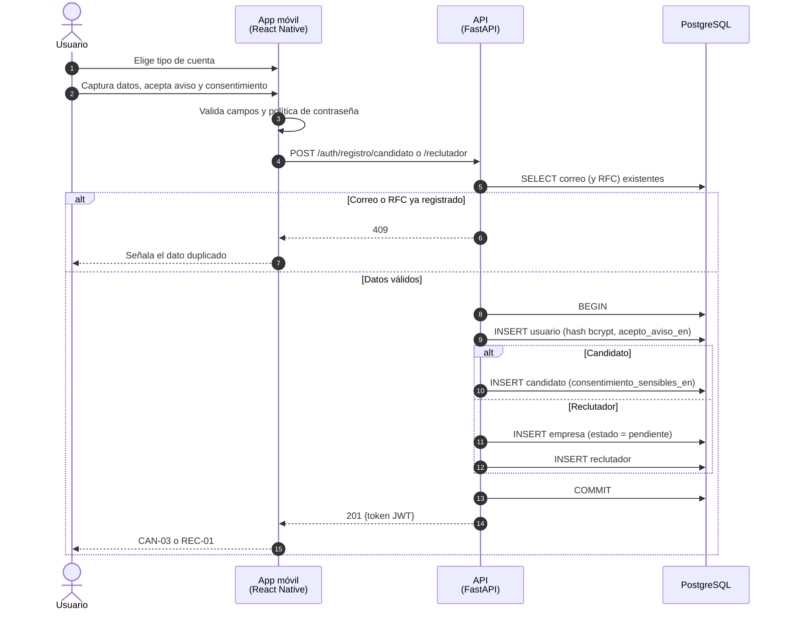
```mermaid
sequenceDiagram
autonumber
actor U as Usuario
participant APP as App móvil<br/>(React Native)
participant API as API<br/>(FastAPI)
participant DB as PostgreSQL
U->>APP: Elige tipo de cuenta
U->>APP: Captura datos, acepta aviso y consentimiento
APP->>APP: Valida campos y política de contraseña
APP->>API: POST /auth/registro/candidato o /reclutador
API->>DB: SELECT correo (y RFC) existentes
alt Correo o RFC ya registrado
  API-->>APP: 409
  APP-->>U: Señala el dato duplicado
else Datos válidos
  API->>DB: BEGIN
  API->>DB: INSERT usuario (hash bcrypt, acepto_aviso_en)
  alt Candidato
    API->>DB: INSERT candidato (consentimiento_sensibles_en)
  else Reclutador
    API->>DB: INSERT empresa (estado = pendiente)
    API->>DB: INSERT reclutador
  end
  API->>DB: COMMIT
  API-->>APP: 201 {token JWT}
  APP-->>U: CAN-03 o REC-01
end
```

## CU-04

**Recuperar la contraseña** · Interfaz: MOV-03 · Actor: Usuario · Secundarios: Servicio de correo

**Precondiciones**

- El usuario tiene acceso al correo con el que se registró.

**Flujo principal**

1. El usuario captura su correo y solicita el código.
2. El sistema envía la solicitud a POST /auth/password/solicitar y muestra siempre el mismo mensaje de confirmación.
3. El API genera un código de 6 dígitos con vigencia de 15 minutos y lo envía por correo.
4. El usuario captura el código y la nueva contraseña dos veces.
5. El sistema envía los datos a POST /auth/password/restablecer.
6. El API valida el código, actualiza la contraseña y marca el código como usado.
7. El sistema regresa a MOV-01 con un mensaje de éxito.

**Flujos alternos**

- 3a. El correo no existe: el API no envía nada, pero el sistema muestra el mismo mensaje para no revelar cuentas.
- 6a. Código incorrecto: el sistema muestra los intentos restantes; al quinto intento fallido el código se invalida.
- 6b. Código vencido: el sistema ofrece reenviar un código nuevo (disponible 60 segundos después del anterior).

**Postcondiciones**

- La contraseña del usuario queda actualizada y el código no puede reutilizarse.

**Requerimientos:** MOV-03: RF-01 a RF-04

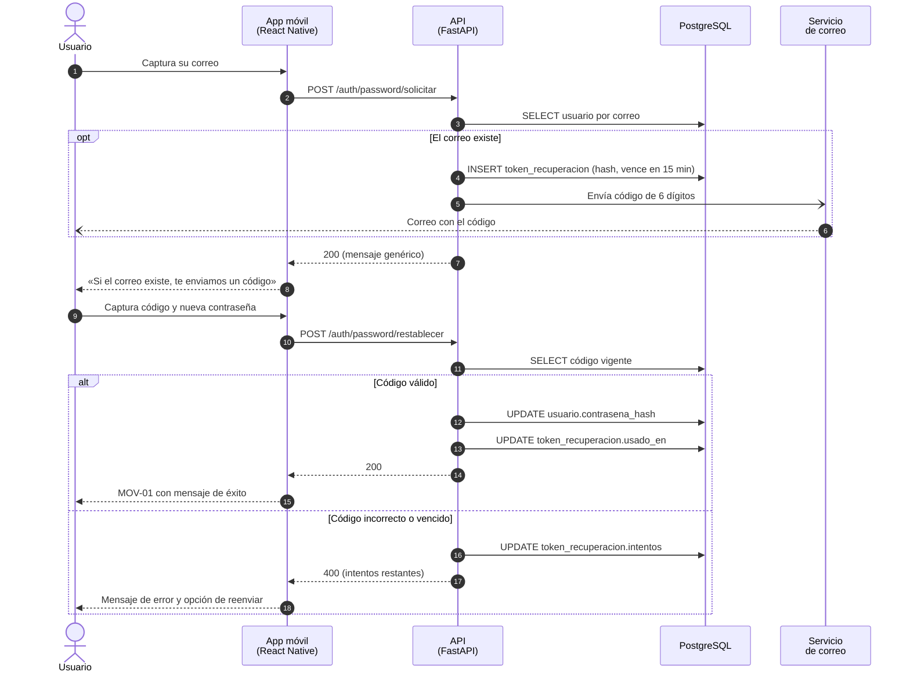
```mermaid
sequenceDiagram
autonumber
actor U as Usuario
participant APP as App móvil<br/>(React Native)
participant API as API<br/>(FastAPI)
participant DB as PostgreSQL
participant MAIL as Servicio<br/>de correo
U->>APP: Captura su correo
APP->>API: POST /auth/password/solicitar
API->>DB: SELECT usuario por correo
opt El correo existe
  API->>DB: INSERT token_recuperacion (hash, vence en 15 min)
  API-)MAIL: Envía código de 6 dígitos
  MAIL--)U: Correo con el código
end
API-->>APP: 200 (mensaje genérico)
APP-->>U: «Si el correo existe, te enviamos un código»
U->>APP: Captura código y nueva contraseña
APP->>API: POST /auth/password/restablecer
API->>DB: SELECT código vigente
alt Código válido
  API->>DB: UPDATE usuario.contrasena_hash
  API->>DB: UPDATE token_recuperacion.usado_en
  API-->>APP: 200
  APP-->>U: MOV-01 con mensaje de éxito
else Código incorrecto o vencido
  API->>DB: UPDATE token_recuperacion.intentos
  API-->>APP: 400 (intentos restantes)
  APP-->>U: Mensaje de error y opción de reenviar
end
```

## CU-05

**Consultar notificaciones** · Interfaz: MOV-04 · Actor: Usuario · Secundarios: Expo Push

**Precondiciones**

- El usuario tiene una sesión activa.

**Flujo principal**

1. El usuario abre la sección de notificaciones.
2. El sistema obtiene GET /notificaciones y muestra la lista con título, mensaje, fecha y estado leída o no leída.
3. El usuario toca una notificación.
4. El sistema la marca como leída (PATCH /notificaciones/{id}/leida) y abre la pantalla relacionada.
5. El contador de no leídas de la barra de navegación se actualiza.

**Flujos alternos**

- 2a. No hay notificaciones: el sistema muestra «No tienes notificaciones».
- 3a. El usuario elige «Marcar todas como leídas»: el sistema llama a PATCH /notificaciones/leidas.
- 3b. El usuario abre Preferencias y activa o desactiva push y correo por tipo de aviso (PUT /notificaciones/preferencias).

**Postcondiciones**

- Las notificaciones abiertas quedan como leídas y las preferencias, guardadas.

**Requerimientos:** MOV-04: RF-01 a RF-06

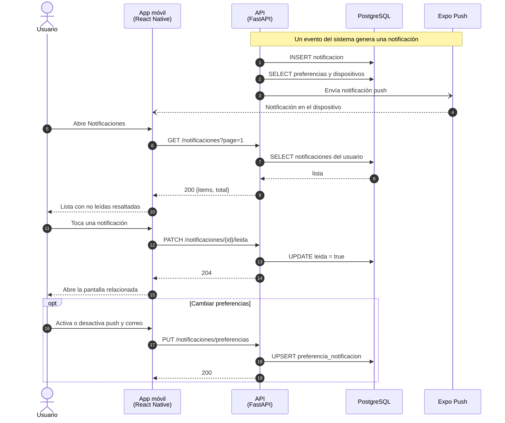
```mermaid
sequenceDiagram
autonumber
actor U as Usuario
participant APP as App móvil<br/>(React Native)
participant API as API<br/>(FastAPI)
participant DB as PostgreSQL
participant PUSH as Expo Push
Note over API,PUSH: Un evento del sistema genera una notificación
API->>DB: INSERT notificacion
API->>DB: SELECT preferencias y dispositivos
API-)PUSH: Envía notificación push
PUSH--)APP: Notificación en el dispositivo
U->>APP: Abre Notificaciones
APP->>API: GET /notificaciones?page=1
API->>DB: SELECT notificaciones del usuario
DB-->>API: lista
API-->>APP: 200 {items, total}
APP-->>U: Lista con no leídas resaltadas
U->>APP: Toca una notificación
APP->>API: PATCH /notificaciones/{id}/leida
API->>DB: UPDATE leida = true
API-->>APP: 204
APP-->>U: Abre la pantalla relacionada
opt Cambiar preferencias
  U->>APP: Activa o desactiva push y correo
  APP->>API: PUT /notificaciones/preferencias
  API->>DB: UPSERT preferencia_notificacion
  API-->>APP: 200
end
```

## CU-06

**Buscar vacantes** · Interfaz: CAN-01 · Actor: Candidato · Secundarios: Ninguno

**Precondiciones**

- El candidato tiene una sesión activa.

**Flujo principal**

1. El candidato abre la pantalla de vacantes.
2. El sistema obtiene GET /vacantes/recomendadas y muestra las vacantes publicadas ordenadas por compatibilidad descendente.
3. El candidato escribe un término de búsqueda o abre el panel de filtros (modalidad, categoría, municipio, jornada, salario, compatibilidad mínima o ajustes).
4. El sistema consulta GET /vacantes con los parámetros y actualiza la lista.
5. El candidato selecciona una vacante y el sistema abre CAN-02.

**Flujos alternos**

- 2a. Perfil incompleto: el sistema muestra un aviso con acceso a CAN-03 y CAN-04.
- 3a. El candidato activa «Solo las que cubren mis necesidades»: el sistema muestra únicamente vacantes que cubren todas sus necesidades de ajuste.
- 4a. Sin resultados: el sistema sugiere quitar filtros.

**Postcondiciones**

- El candidato visualiza vacantes acordes con sus criterios.

**Requerimientos:** CAN-01: RF-01 a RF-06

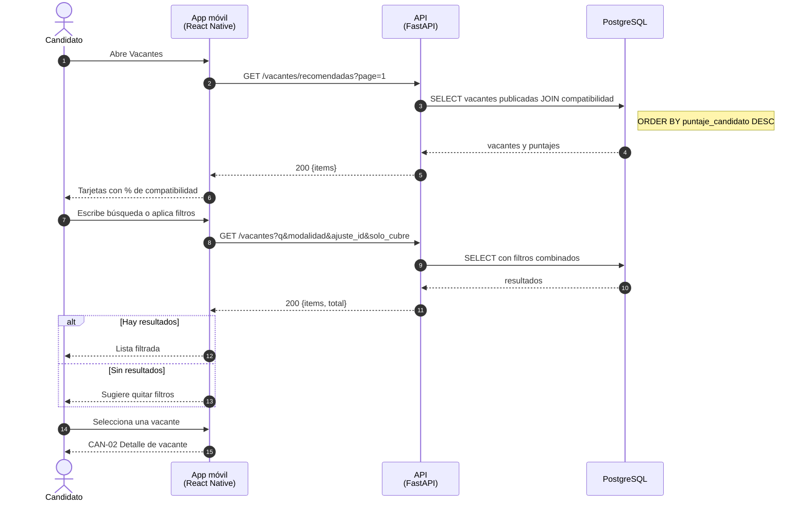
```mermaid
sequenceDiagram
autonumber
actor C as Candidato
participant APP as App móvil<br/>(React Native)
participant API as API<br/>(FastAPI)
participant DB as PostgreSQL
C->>APP: Abre Vacantes
APP->>API: GET /vacantes/recomendadas?page=1
API->>DB: SELECT vacantes publicadas JOIN compatibilidad
Note right of DB: ORDER BY puntaje_candidato DESC
DB-->>API: vacantes y puntajes
API-->>APP: 200 {items}
APP-->>C: Tarjetas con % de compatibilidad
C->>APP: Escribe búsqueda o aplica filtros
APP->>API: GET /vacantes?q&modalidad&ajuste_id&solo_cubre
API->>DB: SELECT con filtros combinados
DB-->>API: resultados
API-->>APP: 200 {items, total}
alt Hay resultados
  APP-->>C: Lista filtrada
else Sin resultados
  APP-->>C: Sugiere quitar filtros
end
C->>APP: Selecciona una vacante
APP-->>C: CAN-02 Detalle de vacante
```

## CU-07

**Consultar una vacante y postularse** · Interfaz: CAN-02 · Actor: Candidato · Secundarios: Ninguno

**Precondiciones**

- El candidato tiene una sesión activa y la vacante está publicada.

**Flujo principal**

1. El candidato abre una vacante desde CAN-01 o CAN-07.
2. El sistema obtiene GET /vacantes/{id} y GET /vacantes/{id}/compatibilidad y muestra la información, los requisitos, la accesibilidad y el desglose de compatibilidad.
3. El candidato presiona «Postularme».
4. El sistema verifica el perfil mínimo y muestra el modal con mensaje opcional y la pregunta de si comparte sus necesidades de ajuste.
5. El candidato confirma y el sistema envía POST /postulaciones.
6. El API crea la postulación en estado «postulada», registra el historial y notifica al reclutador.
7. El sistema confirma la postulación.

**Flujos alternos**

- 4a. Perfil incompleto: el botón aparece deshabilitado con la explicación de lo que falta.
- 6a. Ya existe una postulación (409): el sistema lo indica y ofrece ver la postulación existente.
- 3a. El candidato elige «Reportar vacante»: captura motivo y descripción y el sistema envía POST /reportes.

**Postcondiciones**

- Existe una postulación nueva y el reclutador fue notificado.

**Requerimientos:** CAN-02: RF-01 a RF-09

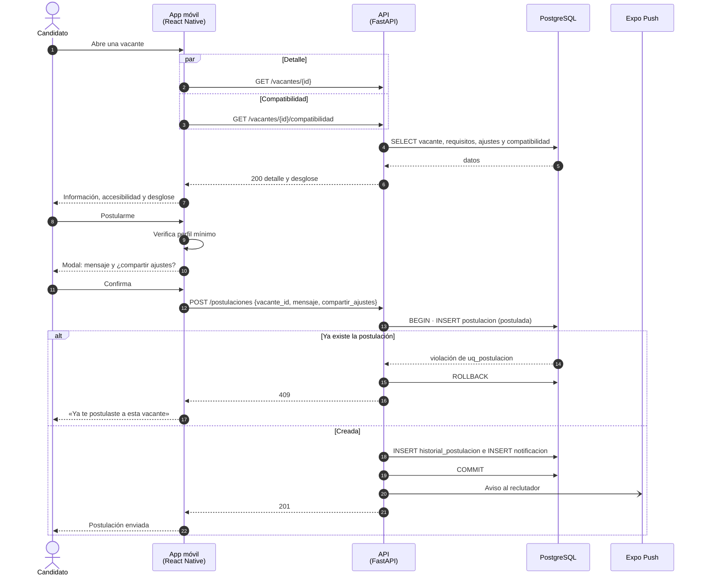
```mermaid
sequenceDiagram
autonumber
actor C as Candidato
participant APP as App móvil<br/>(React Native)
participant API as API<br/>(FastAPI)
participant DB as PostgreSQL
participant PUSH as Expo Push
C->>APP: Abre una vacante
par Detalle
  APP->>API: GET /vacantes/{id}
and Compatibilidad
  APP->>API: GET /vacantes/{id}/compatibilidad
end
API->>DB: SELECT vacante, requisitos, ajustes y compatibilidad
DB-->>API: datos
API-->>APP: 200 detalle y desglose
APP-->>C: Información, accesibilidad y desglose
C->>APP: Postularme
APP->>APP: Verifica perfil mínimo
APP-->>C: Modal: mensaje y ¿compartir ajustes?
C->>APP: Confirma
APP->>API: POST /postulaciones {vacante_id, mensaje, compartir_ajustes}
API->>DB: BEGIN · INSERT postulacion (postulada)
alt Ya existe la postulación
  DB-->>API: violación de uq_postulacion
  API->>DB: ROLLBACK
  API-->>APP: 409
  APP-->>C: «Ya te postulaste a esta vacante»
else Creada
  API->>DB: INSERT historial_postulacion e INSERT notificacion
  API->>DB: COMMIT
  API-)PUSH: Aviso al reclutador
  API-->>APP: 201
  APP-->>C: Postulación enviada
end
```

## CU-08

**Gestionar mi perfil** · Interfaz: CAN-03 · Actor: Candidato · Secundarios: Ninguno

**Precondiciones**

- El candidato tiene una sesión activa.

**Flujo principal**

1. El candidato abre su perfil.
2. El sistema obtiene GET /candidatos/me y muestra sus datos y el porcentaje de completitud.
3. El candidato edita datos personales y preferencias (modalidades, categorías, jornada, reubicación).
4. El candidato selecciona sus necesidades de ajuste del catálogo, agrupadas por categoría, y escribe una nota opcional.
5. El sistema guarda con PUT /candidatos/me y PUT /candidatos/me/necesidades.
6. El API recalcula la completitud y la compatibilidad del candidato.

**Flujos alternos**

- 4a. El candidato no ha otorgado el consentimiento: el sistema lo solicita antes de habilitar la sección.
- 3a. Teléfono con formato inválido: el sistema señala el campo y no guarda.
- 1a. El candidato elige «Eliminar mi cuenta»: tras doble confirmación, el sistema llama a DELETE /candidatos/me y cierra la sesión.

**Postcondiciones**

- El perfil queda actualizado y la compatibilidad, recalculada.

**Requerimientos:** CAN-03: RF-01 a RF-07

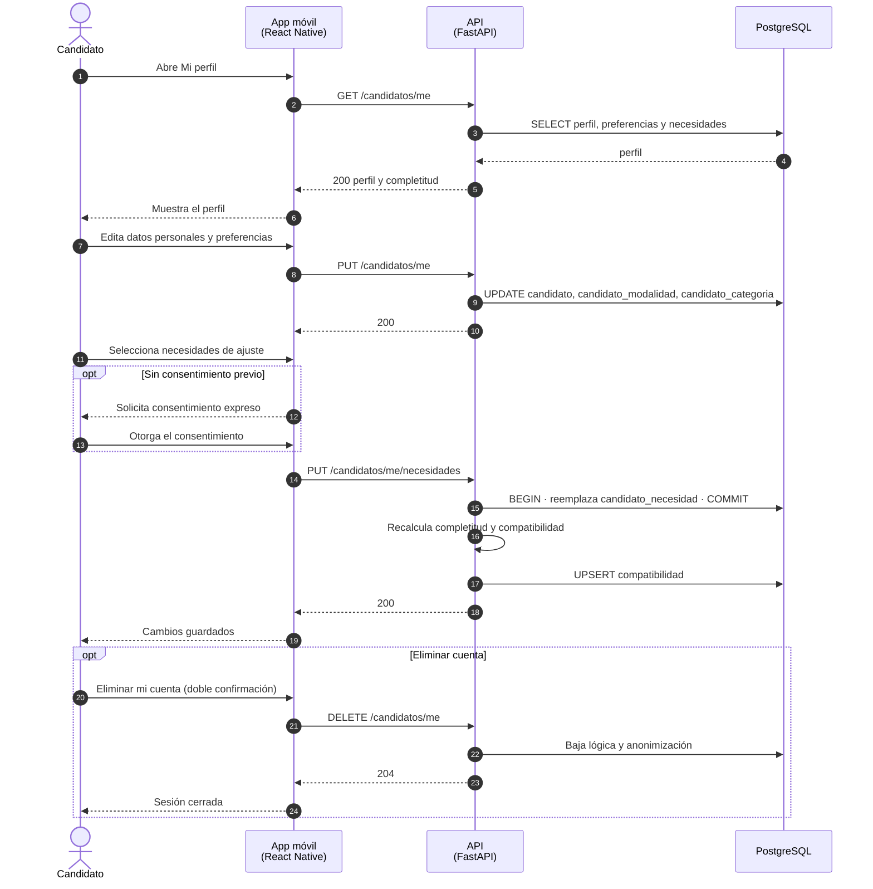
```mermaid
sequenceDiagram
autonumber
actor C as Candidato
participant APP as App móvil<br/>(React Native)
participant API as API<br/>(FastAPI)
participant DB as PostgreSQL
C->>APP: Abre Mi perfil
APP->>API: GET /candidatos/me
API->>DB: SELECT perfil, preferencias y necesidades
DB-->>API: perfil
API-->>APP: 200 perfil y completitud
APP-->>C: Muestra el perfil
C->>APP: Edita datos personales y preferencias
APP->>API: PUT /candidatos/me
API->>DB: UPDATE candidato, candidato_modalidad, candidato_categoria
API-->>APP: 200
C->>APP: Selecciona necesidades de ajuste
opt Sin consentimiento previo
  APP-->>C: Solicita consentimiento expreso
  C->>APP: Otorga el consentimiento
end
APP->>API: PUT /candidatos/me/necesidades
API->>DB: BEGIN · reemplaza candidato_necesidad · COMMIT
API->>API: Recalcula completitud y compatibilidad
API->>DB: UPSERT compatibilidad
API-->>APP: 200
APP-->>C: Cambios guardados
opt Eliminar cuenta
  C->>APP: Eliminar mi cuenta (doble confirmación)
  APP->>API: DELETE /candidatos/me
  API->>DB: Baja lógica y anonimización
  API-->>APP: 204
  APP-->>C: Sesión cerrada
end
```

## CU-09

**Gestionar mi CV** · Interfaz: CAN-04 · Actor: Candidato · Secundarios: Ninguno

**Precondiciones**

- El candidato tiene una sesión activa.

**Flujo principal**

1. El candidato abre la pestaña de experiencia, formación o habilidades.
2. El sistema muestra los registros existentes.
3. El candidato agrega, edita o elimina un registro.
4. El sistema valida los datos (por ejemplo, que la fecha de fin sea posterior a la de inicio) y llama al endpoint correspondiente de /candidatos/me.
5. El API guarda el cambio y recalcula la compatibilidad del candidato con las vacantes publicadas.

**Flujos alternos**

- 4a. Fechas incongruentes: el sistema señala el campo y no envía.
- 4b. Habilidad duplicada o más de 30 habilidades: el sistema lo indica y no la agrega.
- 3a. El candidato elige «Vista previa»: el sistema muestra el CV como lo verá la empresa.

**Postcondiciones**

- El CV queda actualizado y las recomendaciones reflejan los cambios.

**Requerimientos:** CAN-04: RF-01 a RF-06

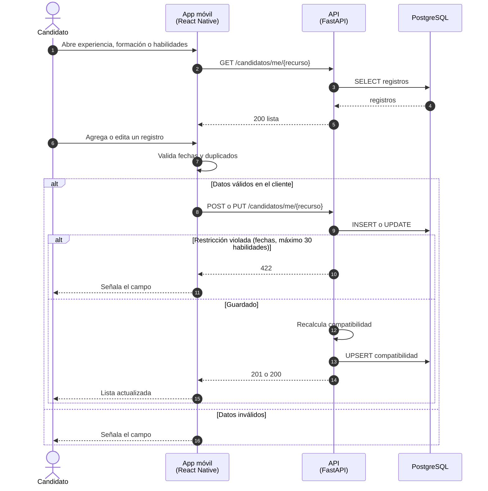
```mermaid
sequenceDiagram
autonumber
actor C as Candidato
participant APP as App móvil<br/>(React Native)
participant API as API<br/>(FastAPI)
participant DB as PostgreSQL
C->>APP: Abre experiencia, formación o habilidades
APP->>API: GET /candidatos/me/{recurso}
API->>DB: SELECT registros
DB-->>API: registros
API-->>APP: 200 lista
C->>APP: Agrega o edita un registro
APP->>APP: Valida fechas y duplicados
alt Datos válidos en el cliente
  APP->>API: POST o PUT /candidatos/me/{recurso}
  API->>DB: INSERT o UPDATE
  alt Restricción violada (fechas, máximo 30 habilidades)
    API-->>APP: 422
    APP-->>C: Señala el campo
  else Guardado
    API->>API: Recalcula compatibilidad
    API->>DB: UPSERT compatibilidad
    API-->>APP: 201 o 200
    APP-->>C: Lista actualizada
  end
else Datos inválidos
  APP-->>C: Señala el campo
end
```

## CU-10

**Consultar mis postulaciones** · Interfaz: CAN-05 · Actor: Candidato · Secundarios: Ninguno

**Precondiciones**

- El candidato tiene una sesión activa.

**Flujo principal**

1. El candidato abre la sección de postulaciones.
2. El sistema obtiene GET /postulaciones/me y muestra cada postulación con puesto, empresa, fecha y estado (texto e ícono).
3. El candidato filtra entre activas y finalizadas o por estado.
4. El candidato selecciona una postulación y el sistema abre CAN-06.

**Flujos alternos**

- 2a. Sin postulaciones: el sistema muestra «Aún no te has postulado» con acceso a CAN-01.
- 3a. El candidato desliza hacia abajo: el sistema vuelve a consultar el API.

**Postcondiciones**

- El candidato conoce el estado de sus postulaciones.

**Requerimientos:** CAN-05: RF-01 a RF-05

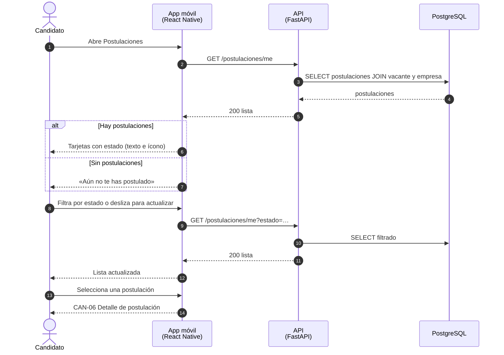
```mermaid
sequenceDiagram
autonumber
actor C as Candidato
participant APP as App móvil<br/>(React Native)
participant API as API<br/>(FastAPI)
participant DB as PostgreSQL
C->>APP: Abre Postulaciones
APP->>API: GET /postulaciones/me
API->>DB: SELECT postulaciones JOIN vacante y empresa
DB-->>API: postulaciones
API-->>APP: 200 lista
alt Hay postulaciones
  APP-->>C: Tarjetas con estado (texto e ícono)
else Sin postulaciones
  APP-->>C: «Aún no te has postulado»
end
C->>APP: Filtra por estado o desliza para actualizar
APP->>API: GET /postulaciones/me?estado=…
API->>DB: SELECT filtrado
API-->>APP: 200 lista
APP-->>C: Lista actualizada
C->>APP: Selecciona una postulación
APP-->>C: CAN-06 Detalle de postulación
```

## CU-11

**Dar seguimiento a una postulación** · Interfaz: CAN-06 · Actor: Candidato · Secundarios: Servicio de correo

**Precondiciones**

- El candidato tiene una postulación; para agendar, la postulación está en estado «entrevista».

**Flujo principal**

1. El candidato abre una postulación.
2. El sistema obtiene GET /postulaciones/{id} y muestra la línea de tiempo de estados con los mensajes del reclutador.
3. Si el estado es «entrevista», el sistema muestra los horarios libres (GET /horarios-entrevista?vacante_id=…&disponible=true).
4. El candidato elige un horario y confirma.
5. El sistema envía POST /postulaciones/{id}/entrevista.
6. El API reserva el horario en una transacción, crea la entrevista y notifica a ambas partes por la app y por correo.
7. El sistema muestra fecha, hora, duración y la liga de Meet o Teams.

**Flujos alternos**

- 6a. El horario ya fue tomado (409): el sistema actualiza la lista y pide elegir otro.
- 7a. El candidato cancela con al menos 24 horas de anticipación: el horario vuelve a quedar libre y se notifica al reclutador.
- 1a. El candidato retira la postulación: tras confirmar, el estado cambia a «retirada».

**Postcondiciones**

- La entrevista queda agendada y ambas partes tienen la liga y la fecha.

**Requerimientos:** CAN-06: RF-01 a RF-06

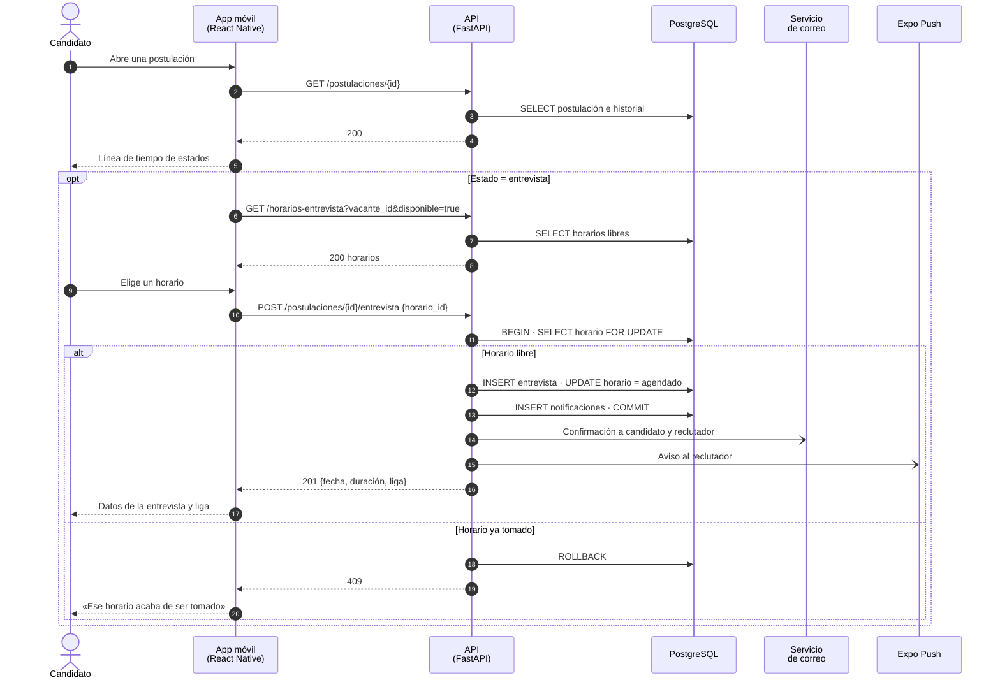
```mermaid
sequenceDiagram
autonumber
actor C as Candidato
participant APP as App móvil<br/>(React Native)
participant API as API<br/>(FastAPI)
participant DB as PostgreSQL
participant MAIL as Servicio<br/>de correo
participant PUSH as Expo Push
C->>APP: Abre una postulación
APP->>API: GET /postulaciones/{id}
API->>DB: SELECT postulación e historial
API-->>APP: 200
APP-->>C: Línea de tiempo de estados
opt Estado = entrevista
  APP->>API: GET /horarios-entrevista?vacante_id&disponible=true
  API->>DB: SELECT horarios libres
  API-->>APP: 200 horarios
  C->>APP: Elige un horario
  APP->>API: POST /postulaciones/{id}/entrevista {horario_id}
  API->>DB: BEGIN · SELECT horario FOR UPDATE
  alt Horario libre
    API->>DB: INSERT entrevista · UPDATE horario = agendado
    API->>DB: INSERT notificaciones · COMMIT
    API-)MAIL: Confirmación a candidato y reclutador
    API-)PUSH: Aviso al reclutador
    API-->>APP: 201 {fecha, duración, liga}
    APP-->>C: Datos de la entrevista y liga
  else Horario ya tomado
    API->>DB: ROLLBACK
    API-->>APP: 409
    APP-->>C: «Ese horario acaba de ser tomado»
  end
end
```

## CU-12

**Consultar empresas** · Interfaz: CAN-07 · Actor: Candidato · Secundarios: Ninguno

**Precondiciones**

- El candidato tiene una sesión activa.

**Flujo principal**

1. El candidato abre el directorio de empresas.
2. El sistema obtiene GET /empresas y muestra las empresas validadas.
3. El candidato busca por nombre o filtra por sector y selecciona una empresa.
4. El sistema muestra la ficha: descripción, sector, tamaño, ubicación, prácticas de inclusión y vacantes publicadas.

**Flujos alternos**

- 4a. El candidato abre una vacante: el sistema muestra CAN-02.
- 4b. El candidato reporta la empresa: captura motivo y descripción y el sistema envía POST /reportes.

**Postcondiciones**

- El candidato conoce a la empresa y sus vacantes.

**Requerimientos:** CAN-07: RF-01 a RF-04

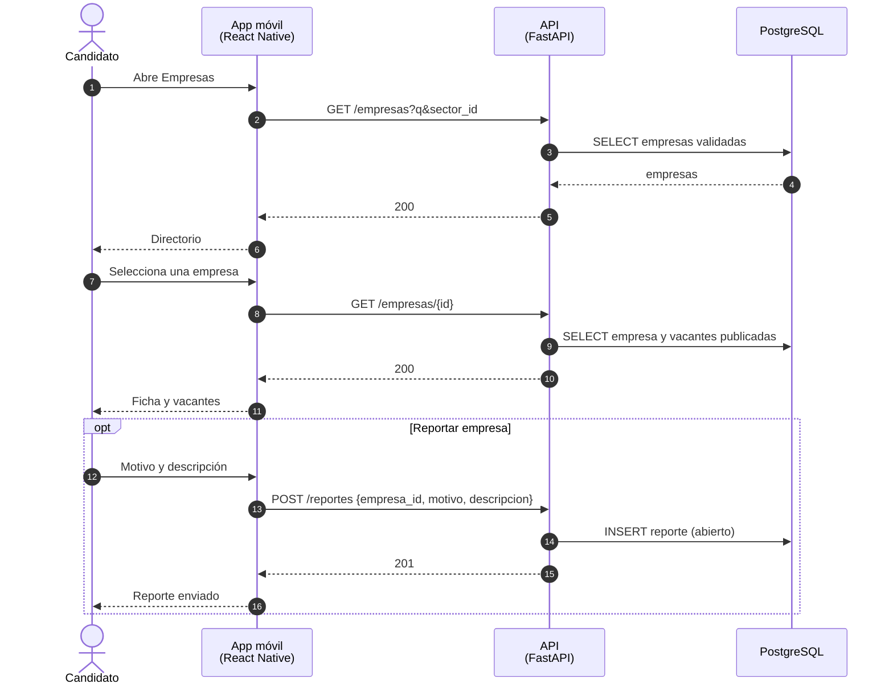
```mermaid
sequenceDiagram
autonumber
actor C as Candidato
participant APP as App móvil<br/>(React Native)
participant API as API<br/>(FastAPI)
participant DB as PostgreSQL
C->>APP: Abre Empresas
APP->>API: GET /empresas?q&sector_id
API->>DB: SELECT empresas validadas
DB-->>API: empresas
API-->>APP: 200
APP-->>C: Directorio
C->>APP: Selecciona una empresa
APP->>API: GET /empresas/{id}
API->>DB: SELECT empresa y vacantes publicadas
API-->>APP: 200
APP-->>C: Ficha y vacantes
opt Reportar empresa
  C->>APP: Motivo y descripción
  APP->>API: POST /reportes {empresa_id, motivo, descripcion}
  API->>DB: INSERT reporte (abierto)
  API-->>APP: 201
  APP-->>C: Reporte enviado
end
```

## CU-13

**Gestionar el perfil de la organización** · Interfaz: REC-01 · Actor: Reclutador · Secundarios: Ninguno

**Precondiciones**

- El reclutador tiene una sesión activa.

**Flujo principal**

1. El reclutador abre el perfil de su organización.
2. El sistema obtiene GET /empresas/me y muestra los datos y el estado de validación.
3. El reclutador edita nombre comercial, sector, tamaño, descripción, sitio web, ubicación, logotipo y prácticas de inclusión.
4. El sistema guarda con PUT /empresas/me.
5. Si la empresa está pendiente, el reclutador sube la constancia de situación fiscal (POST /empresas/me/documento).

**Flujos alternos**

- 3a. La empresa ya está validada: razón social y RFC aparecen en solo lectura.
- 5a. El archivo no es PDF o supera 5 MB: el sistema lo rechaza con un mensaje.
- 2a. Empresa rechazada: el sistema muestra el motivo indicado por el administrador.

**Postcondiciones**

- Los datos de la empresa quedan actualizados y, en su caso, listos para validación.

**Requerimientos:** REC-01: RF-01 a RF-05

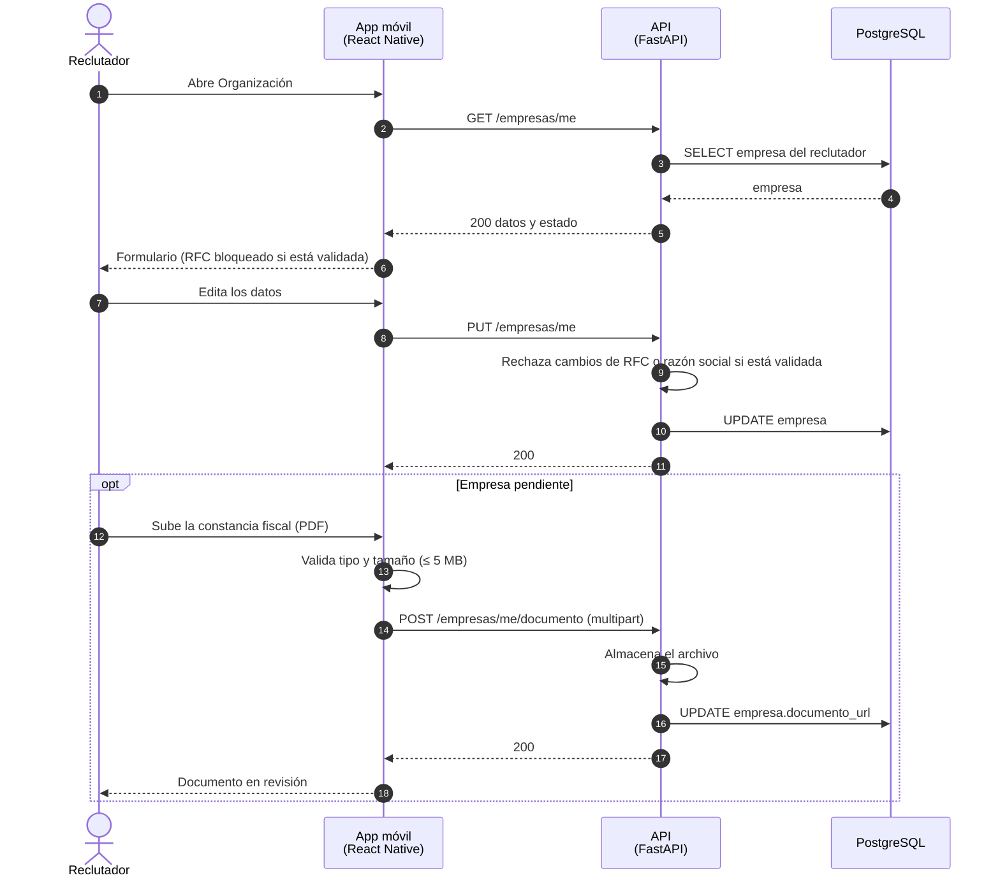
```mermaid
sequenceDiagram
autonumber
actor R as Reclutador
participant APP as App móvil<br/>(React Native)
participant API as API<br/>(FastAPI)
participant DB as PostgreSQL
R->>APP: Abre Organización
APP->>API: GET /empresas/me
API->>DB: SELECT empresa del reclutador
DB-->>API: empresa
API-->>APP: 200 datos y estado
APP-->>R: Formulario (RFC bloqueado si está validada)
R->>APP: Edita los datos
APP->>API: PUT /empresas/me
API->>API: Rechaza cambios de RFC o razón social si está validada
API->>DB: UPDATE empresa
API-->>APP: 200
opt Empresa pendiente
  R->>APP: Sube la constancia fiscal (PDF)
  APP->>APP: Valida tipo y tamaño (≤ 5 MB)
  APP->>API: POST /empresas/me/documento (multipart)
  API->>API: Almacena el archivo
  API->>DB: UPDATE empresa.documento_url
  API-->>APP: 200
  APP-->>R: Documento en revisión
end
```

## CU-14

**Administrar mis vacantes** · Interfaz: REC-02 · Actor: Reclutador · Secundarios: Ninguno

**Precondiciones**

- El reclutador tiene una sesión activa.

**Flujo principal**

1. El reclutador abre la lista de vacantes.
2. El sistema obtiene GET /empresas/me/vacantes y muestra título, estado, número de postulados y postulaciones nuevas.
3. El reclutador filtra por estado y elige una acción: editar, pausar, reanudar, cerrar o duplicar.
4. El sistema confirma la acción y llama a PATCH /vacantes/{id}/estado o POST /vacantes/{id}/duplicar.
5. La lista se actualiza.

**Flujos alternos**

- 3a. La empresa no está validada: el sistema permite crear borradores pero no publicar, y lo indica.
- 2a. Sin vacantes: el sistema muestra «Aún no tienes vacantes» y el botón para crear una.
- 3b. El reclutador toca una vacante: el sistema abre REC-04.

**Postcondiciones**

- Las vacantes reflejan el estado elegido por el reclutador.

**Requerimientos:** REC-02: RF-01 a RF-06

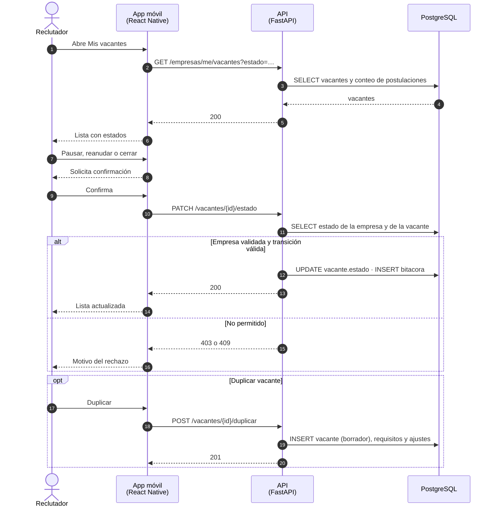
```mermaid
sequenceDiagram
autonumber
actor R as Reclutador
participant APP as App móvil<br/>(React Native)
participant API as API<br/>(FastAPI)
participant DB as PostgreSQL
R->>APP: Abre Mis vacantes
APP->>API: GET /empresas/me/vacantes?estado=…
API->>DB: SELECT vacantes y conteo de postulaciones
DB-->>API: vacantes
API-->>APP: 200
APP-->>R: Lista con estados
R->>APP: Pausar, reanudar o cerrar
APP-->>R: Solicita confirmación
R->>APP: Confirma
APP->>API: PATCH /vacantes/{id}/estado
API->>DB: SELECT estado de la empresa y de la vacante
alt Empresa validada y transición válida
  API->>DB: UPDATE vacante.estado · INSERT bitacora
  API-->>APP: 200
  APP-->>R: Lista actualizada
else No permitido
  API-->>APP: 403 o 409
  APP-->>R: Motivo del rechazo
end
opt Duplicar vacante
  R->>APP: Duplicar
  APP->>API: POST /vacantes/{id}/duplicar
  API->>DB: INSERT vacante (borrador), requisitos y ajustes
  API-->>APP: 201
end
```

## CU-15

**Crear o editar una vacante** · Interfaz: REC-03 · Actor: Reclutador · Secundarios: Ninguno

**Precondiciones**

- El reclutador tiene una sesión activa; para publicar, su empresa está validada.

**Flujo principal**

1. El reclutador inicia una vacante nueva o edita una existente.
2. Captura los datos generales: título, categoría, descripción, jornada, contrato, plazas, ubicación y salario.
3. Define habilidades obligatorias y deseables, formación mínima y años de experiencia.
4. Elige la modalidad y, si es presencial o híbrida, la dirección.
5. Declara las condiciones de accesibilidad existentes y los ajustes que puede ofrecer bajo solicitud, o declara explícitamente que no cuenta con ellas.
6. El reclutador elige «Guardar borrador» o «Publicar» y el sistema envía POST o PUT /vacantes.
7. El API valida los datos, guarda la vacante y calcula la compatibilidad con los candidatos.

**Flujos alternos**

- 6a. Falta un campo obligatorio o la sección de accesibilidad está vacía: el sistema señala el paso incompleto.
- 6b. La empresa no está validada: solo se permite guardar como borrador.
- 7a. La vacante ya tiene postulados: el sistema advierte que la compatibilidad se recalculará y que se avisará a los postulados.

**Postcondiciones**

- La vacante queda guardada como borrador o publicada con su compatibilidad calculada.

**Requerimientos:** REC-03: RF-01 a RF-06

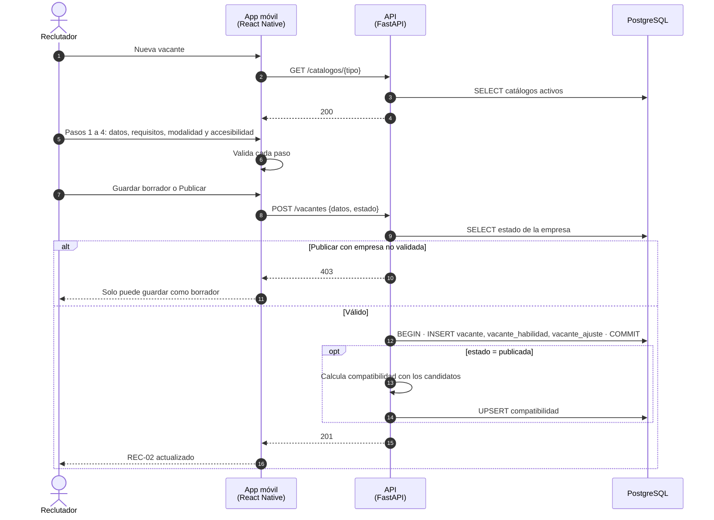
```mermaid
sequenceDiagram
autonumber
actor R as Reclutador
participant APP as App móvil<br/>(React Native)
participant API as API<br/>(FastAPI)
participant DB as PostgreSQL
R->>APP: Nueva vacante
APP->>API: GET /catalogos/{tipo}
API->>DB: SELECT catálogos activos
API-->>APP: 200
R->>APP: Pasos 1 a 4: datos, requisitos, modalidad y accesibilidad
APP->>APP: Valida cada paso
R->>APP: Guardar borrador o Publicar
APP->>API: POST /vacantes {datos, estado}
API->>DB: SELECT estado de la empresa
alt Publicar con empresa no validada
  API-->>APP: 403
  APP-->>R: Solo puede guardar como borrador
else Válido
  API->>DB: BEGIN · INSERT vacante, vacante_habilidad, vacante_ajuste · COMMIT
  opt estado = publicada
    API->>API: Calcula compatibilidad con los candidatos
    API->>DB: UPSERT compatibilidad
  end
  API-->>APP: 201
  APP-->>R: REC-02 actualizado
end
```

## CU-16

**Revisar candidatos postulados** · Interfaz: REC-04 · Actor: Reclutador · Secundarios: Ninguno

**Precondiciones**

- El reclutador tiene una sesión activa y la vacante pertenece a su empresa.

**Flujo principal**

1. El reclutador abre una vacante desde REC-02.
2. El sistema obtiene GET /vacantes/{id}/postulaciones y muestra los postulados ordenados por compatibilidad laboral (sin el componente de accesibilidad).
3. El sistema muestra la etiqueta «Ajustes por confirmar» cuando el candidato compartió necesidades que la vacante no cubre.
4. El reclutador filtra por estado o compatibilidad mínima y selecciona un postulado.
5. El sistema abre REC-05.

**Flujos alternos**

- 2a. Sin postulados: el sistema muestra «Aún no hay postulados».
- 2b. La vacante no pertenece a la empresa del reclutador (403): el sistema regresa a REC-02.

**Postcondiciones**

- El reclutador identifica a los candidatos más afines sin sesgo por necesidades de ajuste.

**Requerimientos:** REC-04: RF-01 a RF-05

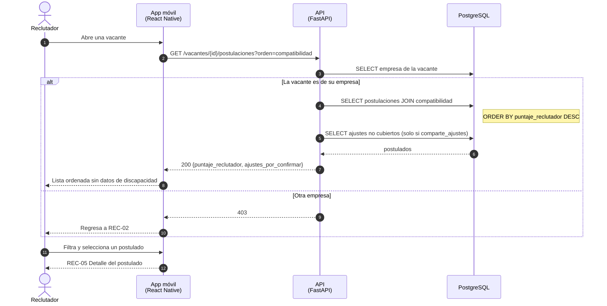
```mermaid
sequenceDiagram
autonumber
actor R as Reclutador
participant APP as App móvil<br/>(React Native)
participant API as API<br/>(FastAPI)
participant DB as PostgreSQL
R->>APP: Abre una vacante
APP->>API: GET /vacantes/{id}/postulaciones?orden=compatibilidad
API->>DB: SELECT empresa de la vacante
alt La vacante es de su empresa
  API->>DB: SELECT postulaciones JOIN compatibilidad
  Note right of DB: ORDER BY puntaje_reclutador DESC
  API->>DB: SELECT ajustes no cubiertos (solo si comparte_ajustes)
  DB-->>API: postulados
  API-->>APP: 200 {puntaje_reclutador, ajustes_por_confirmar}
  APP-->>R: Lista ordenada sin datos de discapacidad
else Otra empresa
  API-->>APP: 403
  APP-->>R: Regresa a REC-02
end
R->>APP: Filtra y selecciona un postulado
APP-->>R: REC-05 Detalle del postulado
```

## CU-17

**Evaluar a un postulado** · Interfaz: REC-05 · Actor: Reclutador · Secundarios: Servicio de correo

**Precondiciones**

- El reclutador tiene una sesión activa y la postulación corresponde a una vacante de su empresa.

**Flujo principal**

1. El reclutador abre un postulado.
2. El sistema obtiene GET /postulaciones/{id}/candidato y muestra el CV, el mensaje y el desglose de compatibilidad.
3. Si el candidato compartió sus necesidades, el sistema las muestra indicando cuáles ya cubre la vacante.
4. El reclutador elige un nuevo estado permitido y escribe un mensaje opcional para el candidato.
5. El sistema envía PATCH /postulaciones/{id}/estado.
6. El API valida la transición, registra el historial y notifica al candidato por la app y por correo.

**Flujos alternos**

- 3a. El candidato no compartió sus necesidades: el sistema muestra «El candidato no compartió esta información».
- 6a. Transición no permitida: el API responde 409 y el estado no cambia.
- 4a. El reclutador registra una observación interna (POST /postulaciones/{id}/observaciones), que no ve el candidato.

**Postcondiciones**

- La postulación cambia de estado, queda en el historial y el candidato es notificado.

**Requerimientos:** REC-05: RF-01 a RF-07

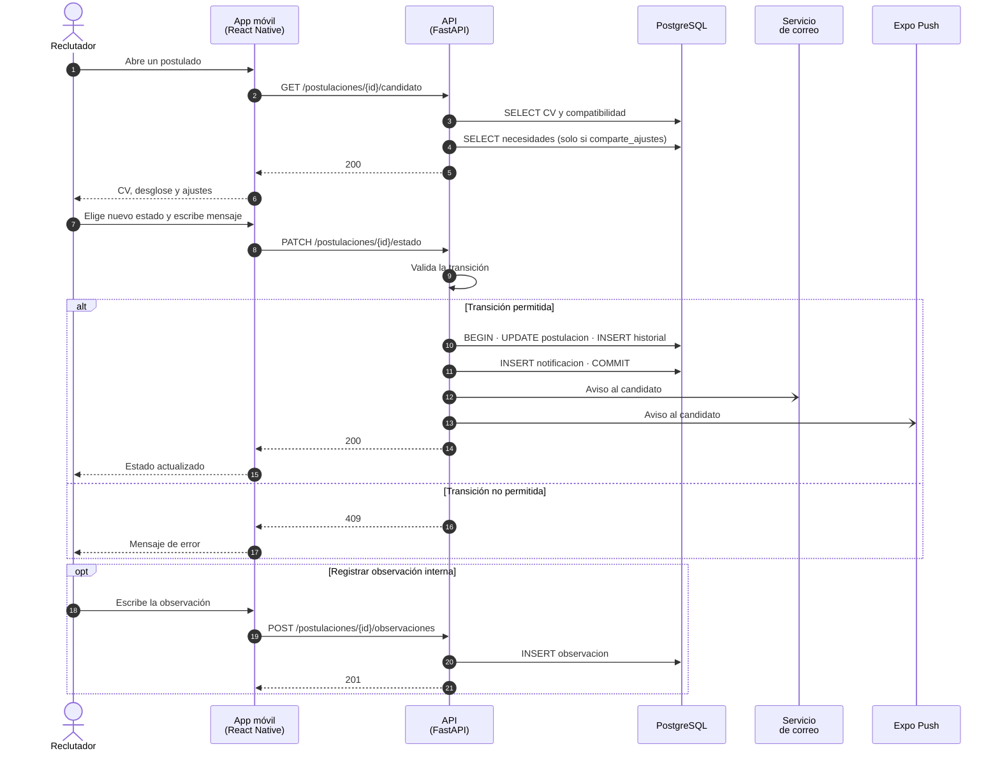
```mermaid
sequenceDiagram
autonumber
actor R as Reclutador
participant APP as App móvil<br/>(React Native)
participant API as API<br/>(FastAPI)
participant DB as PostgreSQL
participant MAIL as Servicio<br/>de correo
participant PUSH as Expo Push
R->>APP: Abre un postulado
APP->>API: GET /postulaciones/{id}/candidato
API->>DB: SELECT CV y compatibilidad
API->>DB: SELECT necesidades (solo si comparte_ajustes)
API-->>APP: 200
APP-->>R: CV, desglose y ajustes
R->>APP: Elige nuevo estado y escribe mensaje
APP->>API: PATCH /postulaciones/{id}/estado
API->>API: Valida la transición
alt Transición permitida
  API->>DB: BEGIN · UPDATE postulacion · INSERT historial
  API->>DB: INSERT notificacion · COMMIT
  API-)MAIL: Aviso al candidato
  API-)PUSH: Aviso al candidato
  API-->>APP: 200
  APP-->>R: Estado actualizado
else Transición no permitida
  API-->>APP: 409
  APP-->>R: Mensaje de error
end
opt Registrar observación interna
  R->>APP: Escribe la observación
  APP->>API: POST /postulaciones/{id}/observaciones
  API->>DB: INSERT observacion
  API-->>APP: 201
end
```

## CU-18

**Gestionar la agenda de entrevistas** · Interfaz: REC-06 · Actor: Reclutador · Secundarios: Servicio de correo

**Precondiciones**

- El reclutador tiene una sesión activa y al menos una vacante publicada.

**Flujo principal**

1. El reclutador elige «Publicar horarios».
2. Captura vacante, fecha, hora de inicio, duración (30, 45 o 60 minutos) y la liga genérica de Meet o Teams.
3. El sistema envía POST /horarios-entrevista.
4. El API valida que la fecha sea futura y que no se traslape con otro horario, y lo guarda como «libre».
5. La agenda muestra los horarios libres y agendados por día.
6. Después de una entrevista, el reclutador la marca como realizada o «no asistió».

**Flujos alternos**

- 4a. El horario se traslapa o la liga no es de Meet o Teams: el sistema muestra el error.
- 5a. El reclutador cancela un horario agendado: captura un motivo y el sistema notifica al candidato.
- 5b. 24 horas antes de cada entrevista, el sistema envía un recordatorio a ambas partes.

**Postcondiciones**

- Los horarios quedan disponibles para que los candidatos los agenden.

**Requerimientos:** REC-06: RF-01 a RF-05

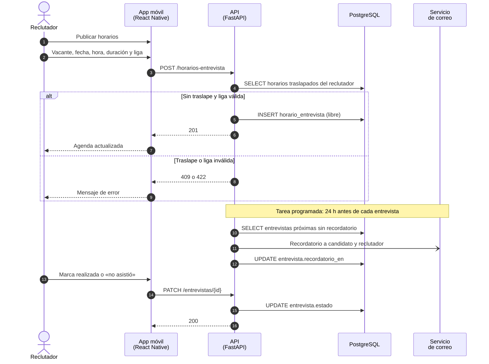
```mermaid
sequenceDiagram
autonumber
actor R as Reclutador
participant APP as App móvil<br/>(React Native)
participant API as API<br/>(FastAPI)
participant DB as PostgreSQL
participant MAIL as Servicio<br/>de correo
R->>APP: Publicar horarios
R->>APP: Vacante, fecha, hora, duración y liga
APP->>API: POST /horarios-entrevista
API->>DB: SELECT horarios traslapados del reclutador
alt Sin traslape y liga válida
  API->>DB: INSERT horario_entrevista (libre)
  API-->>APP: 201
  APP-->>R: Agenda actualizada
else Traslape o liga inválida
  API-->>APP: 409 o 422
  APP-->>R: Mensaje de error
end
Note over API,MAIL: Tarea programada: 24 h antes de cada entrevista
API->>DB: SELECT entrevistas próximas sin recordatorio
API-)MAIL: Recordatorio a candidato y reclutador
API->>DB: UPDATE entrevista.recordatorio_en
R->>APP: Marca realizada o «no asistió»
APP->>API: PATCH /entrevistas/{id}
API->>DB: UPDATE entrevista.estado
API-->>APP: 200
```

## CU-19

**Iniciar sesión en el panel web** · Interfaz: WEB-01 · Actor: Administrador · Secundarios: Ninguno

**Precondiciones**

- El administrador tiene una cuenta activa con rol administrador.

**Flujo principal**

1. El administrador captura su correo y contraseña.
2. Laravel envía las credenciales a POST /auth/login.
3. El API valida las credenciales y devuelve un JWT.
4. Laravel verifica que el rol sea administrador y guarda el token en la sesión del servidor.
5. El sistema muestra el dashboard (WEB-02).

**Flujos alternos**

- 3a. Credenciales inválidas: el sistema muestra un mensaje genérico.
- 4a. El rol no es administrador: el sistema muestra «No tienes permisos de administrador» y cierra la sesión.
- 5a. Más adelante el token vence (401): el sistema redirige a WEB-01.

**Postcondiciones**

- El administrador tiene una sesión activa en el panel.

**Requerimientos:** WEB-01: RF-01 a RF-05

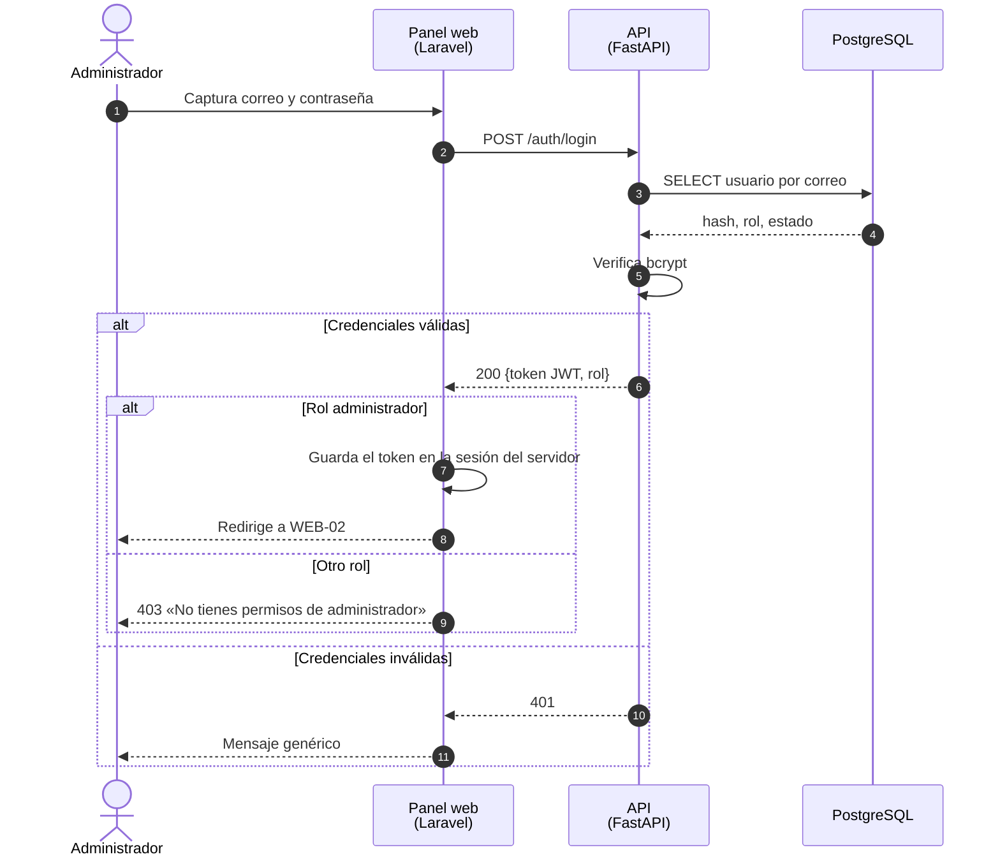
```mermaid
sequenceDiagram
autonumber
actor A as Administrador
participant WEB as Panel web<br/>(Laravel)
participant API as API<br/>(FastAPI)
participant DB as PostgreSQL
A->>WEB: Captura correo y contraseña
WEB->>API: POST /auth/login
API->>DB: SELECT usuario por correo
DB-->>API: hash, rol, estado
API->>API: Verifica bcrypt
alt Credenciales válidas
  API-->>WEB: 200 {token JWT, rol}
  alt Rol administrador
    WEB->>WEB: Guarda el token en la sesión del servidor
    WEB-->>A: Redirige a WEB-02
  else Otro rol
    WEB-->>A: 403 «No tienes permisos de administrador»
  end
else Credenciales inválidas
  API-->>WEB: 401
  WEB-->>A: Mensaje genérico
end
```

## CU-20

**Consultar el dashboard y las estadísticas** · Interfaz: WEB-02 · Actor: Administrador · Secundarios: Ninguno

**Precondiciones**

- El administrador tiene una sesión activa.

**Flujo principal**

1. El administrador abre el dashboard.
2. El sistema obtiene GET /admin/estadisticas/resumen y muestra los indicadores y los pendientes (empresas por validar, reportes abiertos).
3. El sistema muestra las gráficas de vinculación y la brecha entre ajustes solicitados y ofrecidos.
4. El administrador cambia el periodo y el sistema actualiza las métricas.
5. El administrador elige «Exportar» y el sistema descarga el reporte (GET /admin/estadisticas/exportar).

**Flujos alternos**

- 3a. Un indicador agrupa menos de 5 registros: el sistema lo agrupa para evitar identificar personas.
- 2a. El administrador toca un pendiente: el sistema abre WEB-04 o WEB-08.

**Postcondiciones**

- El administrador conoce el estado de la plataforma con datos solo agregados.

**Requerimientos:** WEB-02: RF-01 a RF-07

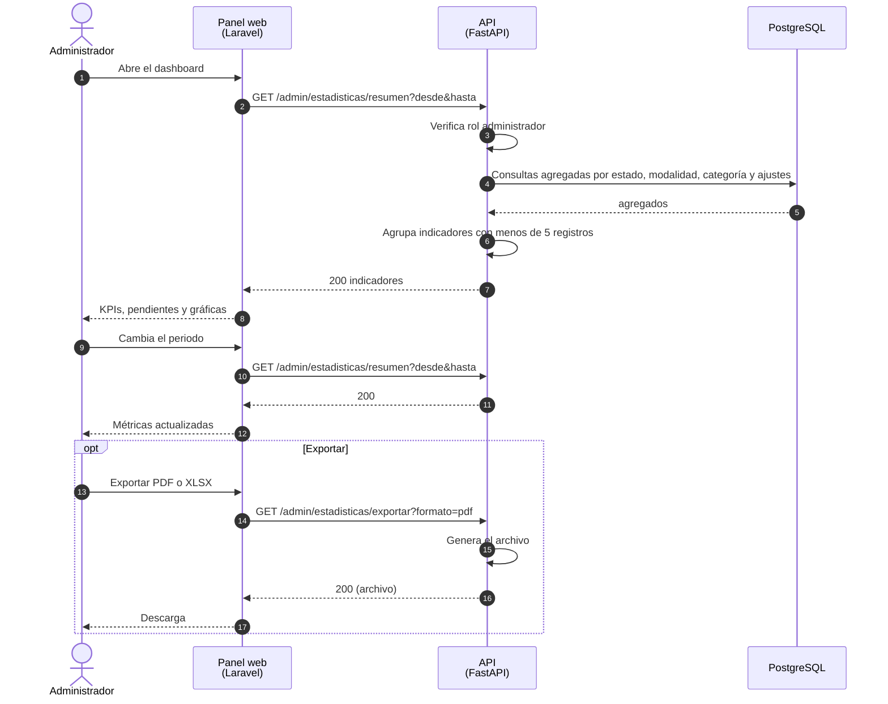
```mermaid
sequenceDiagram
autonumber
actor A as Administrador
participant WEB as Panel web<br/>(Laravel)
participant API as API<br/>(FastAPI)
participant DB as PostgreSQL
A->>WEB: Abre el dashboard
WEB->>API: GET /admin/estadisticas/resumen?desde&hasta
API->>API: Verifica rol administrador
API->>DB: Consultas agregadas por estado, modalidad, categoría y ajustes
DB-->>API: agregados
API->>API: Agrupa indicadores con menos de 5 registros
API-->>WEB: 200 indicadores
WEB-->>A: KPIs, pendientes y gráficas
A->>WEB: Cambia el periodo
WEB->>API: GET /admin/estadisticas/resumen?desde&hasta
API-->>WEB: 200
WEB-->>A: Métricas actualizadas
opt Exportar
  A->>WEB: Exportar PDF o XLSX
  WEB->>API: GET /admin/estadisticas/exportar?formato=pdf
  API->>API: Genera el archivo
  API-->>WEB: 200 (archivo)
  WEB-->>A: Descarga
end
```

## CU-21

**Gestionar usuarios** · Interfaz: WEB-03 · Actor: Administrador · Secundarios: Ninguno

**Precondiciones**

- El administrador tiene una sesión activa.

**Flujo principal**

1. El administrador abre la gestión de usuarios.
2. El sistema obtiene GET /admin/usuarios (paginado de 25) y muestra nombre, correo, rol, empresa, fecha de registro y estado.
3. El administrador busca o filtra por rol y estado.
4. El administrador crea, edita, suspende, reactiva o da de baja un usuario.
5. El API aplica el cambio, lo registra en la bitácora y devuelve el usuario actualizado.

**Flujos alternos**

- 5a. Correo duplicado al crear: el sistema señala el campo.
- 4a. Suspensión o baja sin motivo: el sistema no permite confirmar.
- 4b. El administrador consulta el detalle de un candidato: el sistema no muestra sus necesidades de ajuste.

**Postcondiciones**

- Los usuarios reflejan los cambios y quedan registrados en la bitácora.

**Requerimientos:** WEB-03: RF-01 a RF-06

```mermaid
sequenceDiagram
autonumber
actor A as Administrador
participant WEB as Panel web<br/>(Laravel)
participant API as API<br/>(FastAPI)
participant DB as PostgreSQL
A->>WEB: Abre Usuarios
WEB->>API: GET /admin/usuarios?page&size=25&rol&estado&q
API->>DB: SELECT paginado
DB-->>API: usuarios
API-->>WEB: 200
WEB-->>A: Tabla de usuarios
alt Crear usuario
  A->>WEB: Captura los datos
  WEB->>API: POST /admin/usuarios
  API->>DB: INSERT usuario (hash bcrypt)
  alt Correo duplicado
    API-->>WEB: 409
    WEB-->>A: Señala el correo
  else Creado
    API->>DB: INSERT bitacora
    API-->>WEB: 201
  end
else Suspender o dar de baja
  A->>WEB: Acción y motivo
  WEB->>API: PATCH /admin/usuarios/{id}/estado
  API->>DB: UPDATE usuario.estado · INSERT bitacora
  API-->>WEB: 200
end
WEB-->>A: Tabla actualizada
```

## CU-22

**Validar y gestionar empresas** · Interfaz: WEB-04 · Actor: Administrador · Secundarios: Servicio de correo

**Precondiciones**

- El administrador tiene una sesión activa.

**Flujo principal**

1. El administrador abre la sección de empresas; el sistema muestra primero las pendientes, por antigüedad.
2. El administrador abre una empresa y revisa sus datos fiscales y la constancia.
3. El sistema verifica que el RFC tenga formato válido y no esté duplicado.
4. El administrador elige «Validar» o «Rechazar» (con motivo obligatorio).
5. El sistema envía PATCH /admin/empresas/{id}/validacion.
6. El API actualiza el estado, lo registra en la bitácora y notifica al reclutador.

**Flujos alternos**

- 3a. RFC inválido o duplicado: el sistema lo marca y sugiere rechazar.
- 4a. El administrador suspende una empresa validada: sus vacantes publicadas pasan a «suspendida» y se notifica a los postulados.

**Postcondiciones**

- La empresa queda validada, rechazada o suspendida y el reclutador fue notificado.

**Requerimientos:** WEB-04: RF-01 a RF-06

```mermaid
sequenceDiagram
autonumber
actor A as Administrador
participant WEB as Panel web<br/>(Laravel)
participant API as API<br/>(FastAPI)
participant DB as PostgreSQL
participant MAIL as Servicio<br/>de correo
A->>WEB: Abre Empresas (pendientes)
WEB->>API: GET /admin/empresas?estado=pendiente
API->>DB: SELECT ORDER BY creado_en
API-->>WEB: 200
A->>WEB: Abre una empresa
WEB->>API: GET /admin/empresas/{id}
API->>API: Verifica formato y unicidad del RFC
API-->>WEB: 200 datos, documento y verificaciones
A->>WEB: Validar o Rechazar (con motivo)
WEB->>API: PATCH /admin/empresas/{id}/validacion
API->>DB: BEGIN · UPDATE empresa (estado, validada_por, validada_en)
API->>DB: INSERT bitacora · INSERT notificacion · COMMIT
API-)MAIL: Resultado al reclutador
API-->>WEB: 200
WEB-->>A: Cola actualizada
opt Suspender empresa
  A->>WEB: Suspender (con motivo)
  WEB->>API: PATCH /admin/empresas/{id}/estado
  API->>DB: UPDATE empresa · vacantes publicadas → suspendida
  API-)MAIL: Aviso a reclutador y postulados
  API-->>WEB: 200
end
```

## CU-23

**Moderar vacantes** · Interfaz: WEB-05 · Actor: Administrador · Secundarios: Ninguno

**Precondiciones**

- El administrador tiene una sesión activa.

**Flujo principal**

1. El administrador abre la sección de vacantes.
2. El sistema obtiene GET /admin/vacantes y muestra título, empresa, estado, fecha, postulados y número de reportes.
3. El administrador filtra y abre el detalle de una vacante, incluida su accesibilidad.
4. El administrador suspende la vacante con un motivo (PATCH /admin/vacantes/{id}/estado).
5. El API cambia el estado, lo registra y notifica al reclutador y a los postulados.

**Flujos alternos**

- 4a. Sin motivo: el sistema no permite confirmar.
- 4b. El administrador reactiva una vacante suspendida: vuelve a «publicada».

**Postcondiciones**

- La vacante queda suspendida o reactivada y los involucrados fueron notificados.

**Requerimientos:** WEB-05: RF-01 a RF-04

```mermaid
sequenceDiagram
autonumber
actor A as Administrador
participant WEB as Panel web<br/>(Laravel)
participant API as API<br/>(FastAPI)
participant DB as PostgreSQL
participant PUSH as Expo Push
A->>WEB: Abre Vacantes
WEB->>API: GET /admin/vacantes?con_reportes=true
API->>DB: SELECT vacantes y conteo de reportes
DB-->>API: vacantes
API-->>WEB: 200
A->>WEB: Ver detalle
WEB->>API: GET /vacantes/{id}
API-->>WEB: 200
A->>WEB: Suspender (con motivo)
WEB->>API: PATCH /admin/vacantes/{id}/estado {suspendida, motivo}
API->>DB: BEGIN · UPDATE vacante · INSERT bitacora
API->>DB: INSERT notificaciones · COMMIT
API-)PUSH: Aviso a reclutador y postulados
API-->>WEB: 200
WEB-->>A: Vacante suspendida
```

## CU-24

**Gestionar categorías y habilidades** · Interfaz: WEB-06 · Actor: Administrador · Secundarios: Ninguno

**Precondiciones**

- El administrador tiene una sesión activa.

**Flujo principal**

1. El administrador abre la pestaña de categorías o de habilidades.
2. El sistema muestra los registros con el número de candidatos y vacantes que los usan.
3. El administrador crea o edita un registro.
4. El sistema valida que el nombre sea único y guarda el cambio.

**Flujos alternos**

- 4a. Nombre duplicado: el sistema señala el campo.
- 3a. El administrador intenta eliminar un registro en uso: el sistema solo permite desactivarlo.

**Postcondiciones**

- Las categorías y habilidades disponibles reflejan los cambios.

**Requerimientos:** WEB-06: RF-01 a RF-04

```mermaid
sequenceDiagram
autonumber
actor A as Administrador
participant WEB as Panel web<br/>(Laravel)
participant API as API<br/>(FastAPI)
participant DB as PostgreSQL
A->>WEB: Abre Categorías y habilidades
WEB->>API: GET /admin/habilidades?q
API->>DB: SELECT con conteo de uso
API-->>WEB: 200
A->>WEB: Crea o edita un registro
WEB->>API: POST o PUT /admin/habilidades
API->>DB: INSERT o UPDATE
alt Nombre duplicado
  DB-->>API: violación de UNIQUE
  API-->>WEB: 409
  WEB-->>A: «El nombre ya existe»
else Guardado
  API->>DB: INSERT bitacora
  API-->>WEB: 200 o 201
  WEB-->>A: Tabla actualizada
end
opt Desactivar registro en uso
  A->>WEB: Desactivar
  WEB->>API: PATCH /admin/habilidades/{id} {activo: false}
  API->>DB: UPDATE activo = false
  API-->>WEB: 200
end
```

## CU-25

**Gestionar catálogos** · Interfaz: WEB-07 · Actor: Administrador · Secundarios: Ninguno

**Precondiciones**

- El administrador tiene una sesión activa.

**Flujo principal**

1. El administrador elige un catálogo de la lista lateral.
2. El sistema muestra sus registros.
3. El administrador crea, edita o desactiva un registro; en el catálogo de ajustes captura además la categoría y la descripción en lenguaje claro.
4. El sistema valida que el nombre sea único y guarda con el endpoint de /admin/catalogos/{tipo}.

**Flujos alternos**

- 4a. Nombre duplicado: el sistema señala el campo.
- 3a. Registro en uso: el sistema solo permite desactivarlo, para no afectar perfiles y vacantes existentes.

**Postcondiciones**

- El catálogo queda actualizado y los cambios se reflejan en la app.

**Requerimientos:** WEB-07: RF-01 a RF-04

```mermaid
sequenceDiagram
autonumber
actor A as Administrador
participant WEB as Panel web<br/>(Laravel)
participant API as API<br/>(FastAPI)
participant DB as PostgreSQL
A->>WEB: Elige un catálogo
WEB->>API: GET /admin/catalogos/{tipo}
API->>DB: SELECT registros
API-->>WEB: 200
WEB-->>A: Tabla del catálogo
A->>WEB: Crea, edita o desactiva
WEB->>API: POST, PUT o PATCH /admin/catalogos/{tipo}/{id}
API->>API: Valida datos y unicidad
alt Válido
  API->>DB: INSERT o UPDATE · INSERT bitacora
  API-->>WEB: 200
  WEB-->>A: Catálogo actualizado
else Inválido o en uso
  API-->>WEB: 409 o 422
  WEB-->>A: Mensaje explicativo
end
```

## CU-26

**Atender reportes e incidencias** · Interfaz: WEB-08 · Actor: Administrador · Secundarios: Servicio de correo

**Precondiciones**

- El administrador tiene una sesión activa y existe al menos un reporte.

**Flujo principal**

1. El administrador abre la bandeja de reportes, filtrada por estado.
2. El sistema obtiene GET /admin/reportes y muestra folio, tipo, motivo, quién reporta, fecha y estado.
3. El administrador abre un reporte y el sistema muestra el elemento reportado y los reportes previos contra él.
4. El administrador cambia el estado a «en revisión» y, al terminar, a «resuelto» o «descartado» con una resolución obligatoria.
5. El sistema envía PATCH /admin/reportes/{id}; el API registra el historial y notifica a quien reportó.

**Flujos alternos**

- 4a. Resolución vacía al cerrar: el sistema no permite confirmar.
- 4b. El administrador suspende la vacante, la empresa o el usuario reportado desde el mismo detalle.

**Postcondiciones**

- El reporte queda cerrado con su resolución y su historial.

**Requerimientos:** WEB-08: RF-01 a RF-06

```mermaid
sequenceDiagram
autonumber
actor A as Administrador
participant WEB as Panel web<br/>(Laravel)
participant API as API<br/>(FastAPI)
participant DB as PostgreSQL
participant MAIL as Servicio<br/>de correo
A->>WEB: Abre la bandeja (abiertos)
WEB->>API: GET /admin/reportes?estado=abierto
API->>DB: SELECT reportes
API-->>WEB: 200
A->>WEB: Abre un reporte
WEB->>API: GET /admin/reportes/{id}
API->>DB: SELECT reporte, elemento, reportes previos e historial
API-->>WEB: 200
A->>WEB: Tomar en revisión
WEB->>API: PATCH /admin/reportes/{id} {en_revision}
API->>DB: UPDATE reporte · INSERT historial_reporte
A->>WEB: Resolver con resolución
WEB->>API: PATCH /admin/reportes/{id} {resuelto, resolucion, accion}
API->>DB: BEGIN · UPDATE reporte (cerrado_en) · INSERT historial_reporte
opt accion = suspension
  API->>DB: UPDATE vacante, empresa o usuario → suspendida
end
API->>DB: INSERT notificacion (reportante) · COMMIT
API-)MAIL: Aviso a quien reportó
API-->>WEB: 200
WEB-->>A: Reporte cerrado
```

## CU-27

**Atender peticiones de los clientes (API)** · Interfaz: API · Actor: App móvil, Panel web · Secundarios: Servicio de correo, Expo Push

**Precondiciones**

- El API y la base de datos PostgreSQL están en operación.

**Flujo principal**

1. Un cliente (app móvil o panel web) envía una petición HTTPS al API con su JWT.
2. El API valida el token y autoriza la operación según el rol y la propiedad del recurso.
3. El API valida los datos de entrada con Pydantic.
4. El API ejecuta la regla de negocio correspondiente y, si modifica varios registros, lo hace dentro de una transacción.
5. Si la operación lo requiere, recalcula la compatibilidad o genera notificaciones, que se envían por push y correo en segundo plano.
6. El API responde en JSON con el código HTTP correspondiente.

**Flujos alternos**

- 2a. Token ausente, vencido o inválido: el API responde 401.
- 2b. El rol o la propiedad no permiten la operación: el API responde 403.
- 3a. Datos inválidos: el API responde 422 con el detalle por campo.
- 4a. Conflicto (duplicado, horario ocupado o transición no permitida): el API responde 409 sin modificar datos.

**Postcondiciones**

- La operación se aplica de forma completa y consistente, o no se aplica.

**Requerimientos:** API: RF-01 a RF-13

```mermaid
sequenceDiagram
autonumber
participant CLI as Cliente<br/>(App móvil o Panel web)
participant MW as Middleware<br/>JWT y roles
participant VAL as Validación<br/>(Pydantic)
participant SRV as Servicio<br/>de negocio
participant DB as PostgreSQL
participant BG as Tareas en<br/>segundo plano
participant MAIL as Servicio<br/>de correo
participant PUSH as Expo Push
CLI->>MW: Petición HTTPS con Bearer JWT
alt Token ausente o inválido
  MW-->>CLI: 401
else Rol o propiedad no autorizados
  MW-->>CLI: 403
else Autorizado
  MW->>VAL: Petición autenticada
  alt Datos inválidos
    VAL-->>CLI: 422 {detail por campo}
  else Datos válidos
    VAL->>SRV: Datos validados
    SRV->>DB: BEGIN · operaciones
    alt Conflicto (duplicado, horario ocupado, transición)
      DB-->>SRV: error de integridad
      SRV->>DB: ROLLBACK
      SRV-->>CLI: 409 {detail}
    else Éxito
      SRV->>DB: COMMIT
      opt Afecta la compatibilidad
        SRV->>DB: UPSERT compatibilidad
      end
      opt Genera notificación
        SRV-)BG: Encola el envío
        BG-)PUSH: Notificación push
        BG-)MAIL: Correo
      end
      SRV-->>CLI: 200 o 201 (JSON)
    end
  end
end
```
